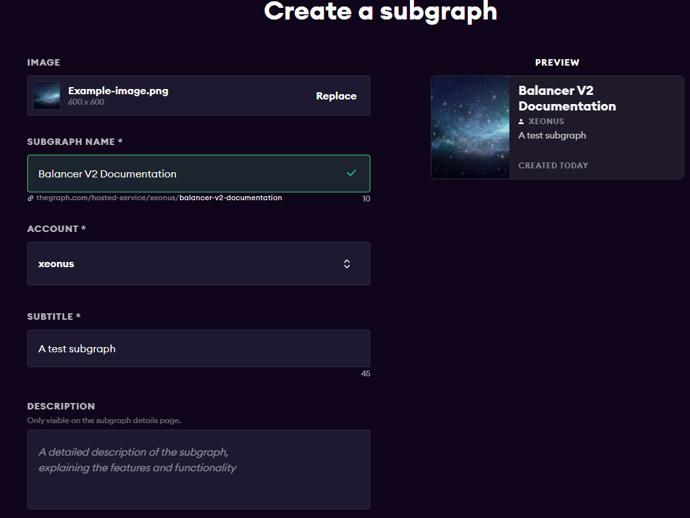

# Deployment

## Getting started


Please note that the hosted service of TheGraph is a free service. There could be potential changes of how Graphs can be deployed in the future. Check the development status and policies directly at [https://thegraph.com/hosted-service/](https://thegraph.com/hosted-service/)


### Prerequisites

You need the following tools / accounts set up in order to be able to deploy your own subgraphs:

* a [GitHub ](https://github.com)account
* a [Graph Hosted Service](https://thegraph.com/hosted-service/) account (can be linked with your GitHub account)
* an IDE, such as Visual Studio Code or similar development environment to compile and deploy a subgraph

## Prepare the Graph Hosted Service Instance


You first need to set up your [hosted service](https://thegraph.com/hosted-service/) account and instance, before you can host your graph:

1. Login to [https://thegraph.com/hosted-service/dashboard](https://thegraph.com/hosted-service/dashboard) (e.g. with your GitHub account)
2. Click "Add Subgraph"
3. Specify a unique name and further information such as your GitHub repo you want to deploy (e.g. your own fork of [balancer-subgraph-v2](https://github.com/balancer-labs/balancer-subgraph-v2)). Check out other subgraphs for examples

The creation screen should look something like this:



## Configure your Local Instance

### Install local dependencies (and initialize your graph)

```shell
#Run locally in your terminal or dev environment
#npm:
npm install -g @graphprotocol/graph-cli
#Yarn:
yarn global add @graphprotocol/graph-cli
```

#### Optional: Initialize a new subgraph folder from scratch


We highly recommend to create your own .yaml files with all the needed specifications. You can also do this manually to create a subgraph manifest, as explained below)


```shell
#Initialization with above example
graph init --product balancer-labs/balancer-v2-documentation
```

You are then asked to correctly configure / initialize your graph:

1. Choose protocol
2. Choose product (in our case hosted-service)
3. Provide a name (same as above, e.g. balancer-labs/balancer-v2-documentation)
4. Choose which chain you want to index (mainnet, matic, arbitrum, etc)
5. Define the contract address

### Deployment based on .yaml files


If you want to deploy your own fork with your contracts, make sure to first deploy them and specify the starting blocks at which TheGraph should start to index. This is mission critical for a successful deployment. You can check out the subraph.\<network>.yaml example files from the [Balancer Labs subgraph](https://github.com/balancer-labs/balancer-subgraph-v2)


Execute following commands in your subgraph folder after granting access to the hosted service:

```
#Codegen
yarn codegen subgraph.yaml
#Deploy
graph deploy --product hosted-service balancer-labs/balancer-v2-documentation subgraph.yaml
```

To summarize, following steps had to be taken to deploy a subgraph instance to the hosted service

1. Set up an account at TheGraph Hosted Service platform
2. Initalize a subgraph
3. Create your own or clone the balancer-v2 subgraph
4. Modify .yaml files and subgraph logic to your desire
5. Deploy the instance based on a .yaml-file configuration
